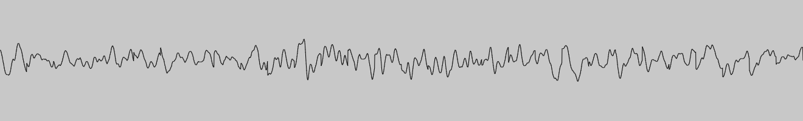

# 音频可视化

## 项目文件结构

```
.
├── build // 打包后的文件
├── public // 静态文件
│   ├── favicon.ico // 图标
│   └── index.html // HTML 模板
├── src // 源码主体
│   ├── app.tsx // 页面总体组件，包括音频处理逻辑
│   ├── component
│   │   ├── audio-upload.less // 文件上传组件的样式
│   │   ├── audio-upload.tsx // 处理文件上传的组件
│   │   ├── freq-canvas.tsx // 展示频率直方图的组件
│   │   └── wave-canvas.tsx // 展示波形图的组件
│   ├── index.css // 不常变化的样式，避免编译太多的样式，加快编译速度
│   ├── index.less // 页面总体样式
│   ├── index.tsx // 入口文件
│   ├── react-app-env.d.ts
│   ├── utils
│   │   ├── draw-frequency.ts // 绘制频率直方图的函数
│   │   ├── draw-wave.ts // 绘制波形图的函数
│   │   ├── index.ts
│   │   └── types.ts // 类型定义
│   └── webkit-scrollbar.css // 设置 webkit 浏览器的滚动条样式
└── ... // 其它辅助文件
```

## 项目简介

本项目使用 React 框架搭建了一个纯前端的页面，能根据用户上传的音频文件绘制出相应的波形图和频率分布直方图。

> 这里使用了 “上传” 一词，但实际上本项目并没有后端，文件只是上传到浏览器内，然后在浏览器内处理。

### 使用方法

点击页面左上角的按钮向浏览器上传一个音频文件，待文件加载完后，点击播放按钮，浏览器会播放上传的音频文件，同时在两个画布上会分别显示音频的波形图和频率分布图。注意，由于 API 的限制，停止播放后，无论是否播放到结尾，再次点击播放按钮都会**从头开始播放**，目前无法实现暂停后续播的功能。

### 技术简介

本项目使用 React 作为 UI 框架，搭配 `Ant Design` 的部分组件和样式搭建用户界面。对音频文件的处理使用了 [Web Audio API](https://developer.mozilla.org/en-US/docs/Web/API/Web_Audio_API)，获得处理完的数据后，使用 [Canvas API](https://developer.mozilla.org/en-US/docs/Web/API/Canvas_API) 将得到的数据可视化。

在 `wasm` 分支中，绘制频率直方图的函数用 Rust 重写了，这主要是为了测试 Rust  + WebAssembly 与 React 项目的联动。对于本项目里这种简单的需求，使用 WebAssembly 对性能并没有多大的影响，所以该分支的代码仅作参考，不合并到主分支。

## Web Audio API 简介

[Web Audio API](https://developer.mozilla.org/en-US/docs/Web/API/Web_Audio_API) 提供了在 Web 上控制音频的一个非常强大通用的系统，允许开发者自选音频源、给音频添加特效、使音频可视化、添加空间效果等。

> 在本项目中，与音频处理相关的代码都在 `src/app.tsx` 文件中的 `App` 组件内。

### 基础概念

Web Audio API 通过**音频上下文** (`AudioContext`) 管理所有的音频操作，所以在做任何音频操作之前，都要先创建音频上下文实例：

```js
const ctx = new AudioContext();
```

在音频上下文中，每一个音频操作都是一个**音频节点** (`AudioNode`)，这些节点可以连接在一起构成一张图，它们接受前一个节点的输出，并向后一个节点提供处理后的音频数据。音频数据在这张图中流动，每经过一个节点就会被这个节点处理。要处理音频，整张图必须要有一个输入，这个输入可以是音频文件，也可以是设备的麦克风等。处理后的音频可以输出到设备的扬声器等，不过这不是必须的，因为有时我们只需要处理过程中的副作用。

### 音频源

音频源有很多种，这里只介绍项目中用到的部分。

本项目使用文件读取接口 [File](https://developer.mozilla.org/en-US/docs/Web/API/File) 以及 [File Reader](https://developer.mozilla.org/en-US/docs/Web/API/FileReader) 将用户选择的文件读取到 `ArrayBuffer` 实例中，然后通过 `AudioContext` 的 `decodeAudioData` 方法将文件内容解析成音频数据并存储到 `AudioBuffer` 实例中。然后创建一个 `AudioBufferSourceNode` 实例作为输入节点，并将其 `buffer` 属性设置为之前存储音频数据的 `AudioBuffer` 实例。

`AudioBufferSourceNode` 具有 `start` 和 `stop` 方法，就像它们的名字一样，它们分别可以让音频源开始播放以及停止播放。要注意的是，一个 `AudioBufferSourceNode` 只能播放一次，即如果调用一次 `start` 后就不能再调用 `start` 了，如果有需要，则必须再创建一个新的 `AudioBufferSourceNode` 实例。

`AudioBufferSourceNode` 停止播放时，不管是播放到结尾还是被调用了 `stop` 方法，都会触发 `ended` 事件。可以通过设置 `AudioBufferSourceNode` 实例的 `onended` 属性来监听这个事件。

### 音频分析

`AnalyserNode` 接口提供了实时分析音频数据的功能，它不会更改音频数据，而是通过傅里叶变换得到音频的时域和频域数据，利用这些数据可以方便地实现音频的可视化。`AnalyserNode` 的 `fftSize` 属性用于设置 FFT（快速傅里叶变换）的窗口大小，`getByteTimeDomainData` 和 `getByteFrequencyData` 两个方法分别用于获取 `uint8` 类型的时域和频域数据，它们接受一个 `Uint8Array` 类型的参数，相应的数据会写到这个参数指向的数组中，数组的大小必须与 `frequencyBinCount` 属性的值相同。

### 音频目的地

`AudioContext` 的 `destination` 属性代表了设备的默认音频输出，通常是设备的扬声器。将音频源与该节点相连后，即可在设备上播放音频源里的音频。

## Canvas API 简介

[Canvas API](https://developer.mozilla.org/en-US/docs/Web/API/Canvas_API) 提供了一个通过 JavaScript 和 HTML 的 `<canvas>` 元素来绘制图形的方式。它可以用于动画、游戏画面、数据可视化、图片编辑以及实时视频处理等方面。本项目只使用了它的 2D 绘图 API。

> 在本项目中，绘制波形图的代码在 `src\utils\draw-wave.ts` 中，绘制频率分布直方图的代码在 `src\utils\draw-frequency.ts` 中；而调用绘图函数以及展示绘图结果的代码分别在 `src\component\wave-canvas.tsx` 和 `src\component\freq-canvas.tsx` 中。

### 基础概念

和音频处理一样，Canvas 也需要一个**上下文**实例来执行绘图操作。可以通过下面的代码创建一个 画布 `canvas` 的 2D 绘图上下文：

```js
const ctx = canvas.getContext('2d');
```

Canvas API 的绘图 2D 绘图接口与其它常见语言的绘图接口非常相似，这里不再赘述。下面主要介绍本项目的绘图方法。

### 波形图

使用 `AnalyserNode` 的 `getByteTimeDomainData` 方法可以得到当前 FFT 窗口内的波形数据，利用这些数据在画布上连线即可得到一条折线图。不过如果每次都只绘制当前得到的折线图，就会给人一种跳跃感，让人看不出波形图的感觉。为了解决这个问题，本项目使用了 “缓存” 技术，即缓存最近的 30 次数据，并把它们一起画出来。这样，每次画图时都是最新的数据接在后面，最早的数据被去掉，从而产生了波形从右向左移动的感觉。

### 频率分布直方图

使用 `AnalyserNode` 的 `getByteFrequencyData` 方法可以得到当前 FFT 窗口内的频域数据，根据这些数据即可绘制出频率分布直方图。不过如果只根据得到的数据绘图的话就只能画出目前效果的右半部分，这里为了对称美观，在左半部分对称地又画了一遍，这也与主流音乐播放软件的频域图效果一致。

## 效果展示

1. 波形图

   

2. 频率分布直方图

   
